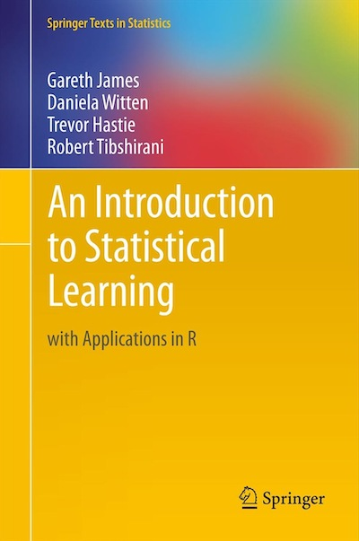

Code and exercises from 
[An Introduction to Statistical Learning](http://faculty.marshall.usc.edu/gareth-james/ISL/).

</img>

The book and course uses R but I'm using Python 3. 


## Datasets

Find these in `/datasets`

## Notes and Exercises

Notes and exercises are organized by chapter in a directory like `/<chapter name` which contains:

- `<chapter_name>_notes.pdf` - Pdf of chapter notes for easy reading.
- `/<chapter_name>_exercises` - directory for exercise files. Contains one or more of:
	- `/<chapter_name>_conceptual_exercises.ipynb` - single Jupyter Notebook for all conceptual exercises
	- `/<chapter_name>_<exercise name>.ipynb` - Jupyter Notebook for `<exercise name>`
	- `/<chapter_name>_<exercise name>.py` - Python script for `<exercise name>`.


## Requirements and Dependencies.

Python dependencies were managed with a
[conda virtual environment](https://docs.conda.io/projects/conda/en/latest/user-guide/tasks/manage-environments.html#). The requirements are stored in the config file `environment.yml`. 

If you have conda installed you can create the environment directly with

```
conda env create -f environment.yml
```
